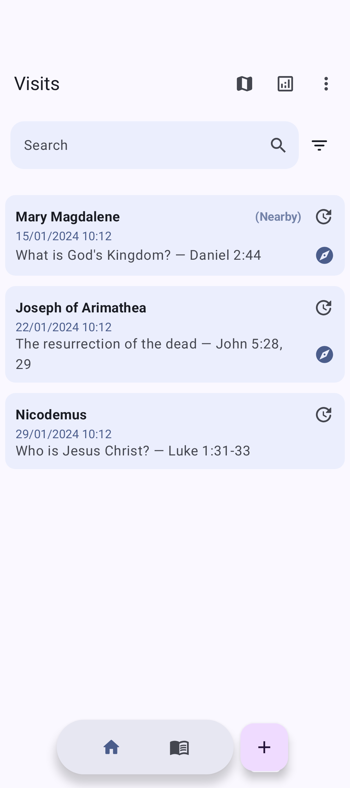
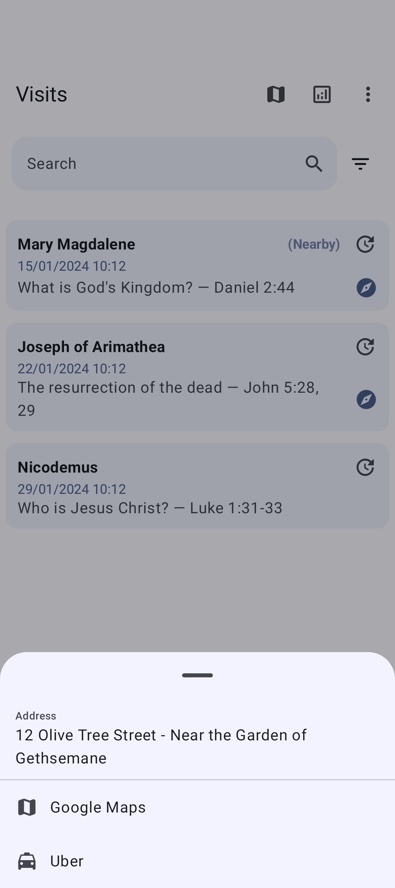
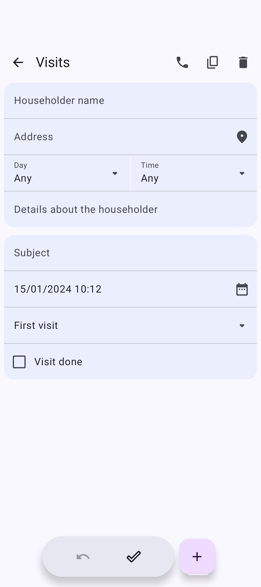
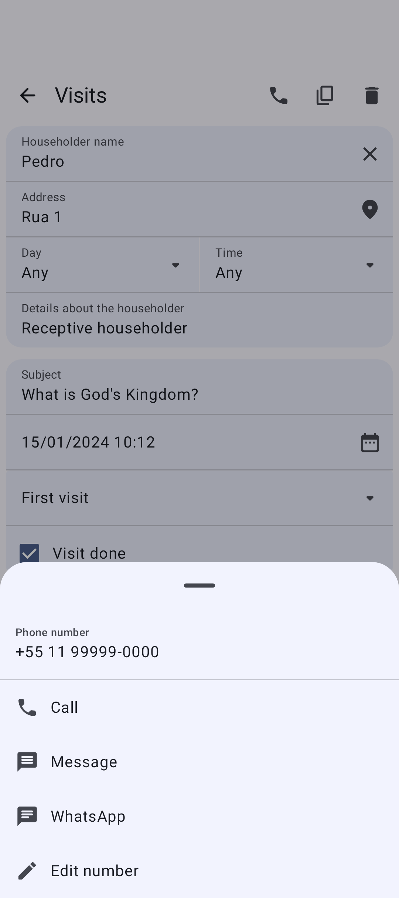
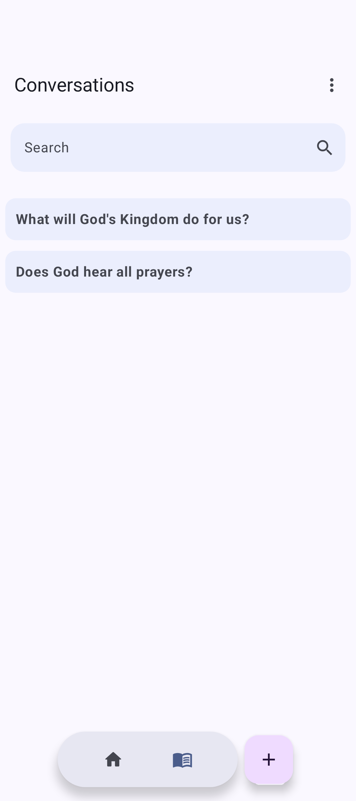
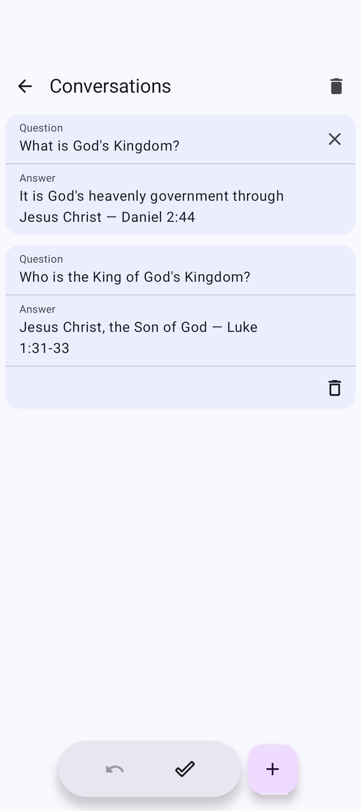
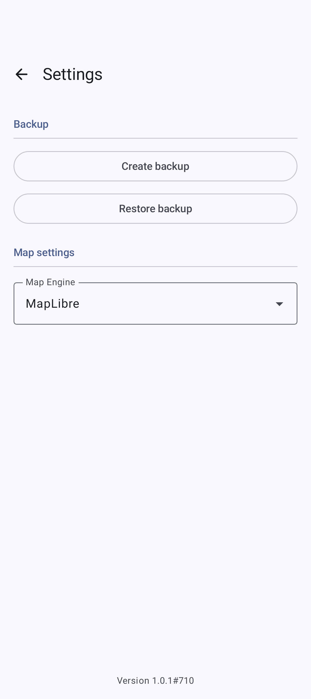

# Visitas

[](https://github.com/MS-Mobile/Visitas/actions/workflows/pull-request-build.yml)

An Android application for managing visits and householder records.

## Screenshots

|                                 Visit list                                 |                                         Visit list address options                                         |
|:--------------------------------------------------------------------------:|:----------------------------------------------------------------------------------------------------------:|
|  |  |

|                                  Visit detail                                  |                                  Visit detail phone options                                  |
|:------------------------------------------------------------------------------:|:--------------------------------------------------------------------------------------------:|
|  |  |

|                                    Conversation list                                     |                                     Conversation detail                                      |
|:----------------------------------------------------------------------------------------:|:--------------------------------------------------------------------------------------------:|
|  |  |

|                                Settings                                | 
|:----------------------------------------------------------------------:|
|  |                                                                                           

## Tech Stack

- **Language:** Kotlin
- **UI:** Jetpack Compose with Material 3
- **Architecture:** MVVM with Unidirectional Data Flow (UDF)
- **Dependency Injection:** Hilt
- **Database:** Room
- **Navigation:** Compose Destinations
- **Async:** Kotlin Coroutines & Flow
- **Serialization:** Moshi

## Requirements

- Android Studio Ladybug or later
- JDK 17
- Android SDK 36 (minimum SDK 26)

## Getting Started

1. Clone the repository
2. Open the project in Android Studio
3. Sync Gradle dependencies
4. Run the app on an emulator or physical device

## Project Structure

```
com.msmobile.visitas/
├── di/                 # Hilt dependency injection modules
├── extension/          # Kotlin extension functions
├── ui/
│   ├── theme/          # Material 3 theming
│   └── views/          # Reusable Compose components
├── util/               # Utility classes and helpers
└── [feature]/          # Feature packages
    ├── Entity.kt       # Room entity
    ├── Dao.kt          # Room DAO interface
    ├── Repository.kt   # Data repository
    ├── ViewModel.kt    # Screen ViewModel
    └── Screen.kt       # Compose screen
```

## Development

See [GUIDELINES.md](.github/GUIDELINES.md) for detailed development conventions and patterns.

The screenshots above are curated from the Compose screenshot-test reference
renders. After changing a screen, refresh them with:

```
./gradlew :app:updateDebugScreenshotTest   # regenerate reference renders
sh scripts/sync-readme-screenshots.sh       # copy curated shots into docs/screenshots/
```

Enable the pre-commit hook once per clone to keep the gallery in sync
automatically whenever the reference renders change:

```
git config core.hooksPath .githooks
```

## License

All rights reserved.
